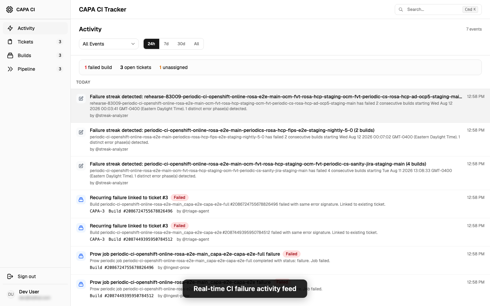
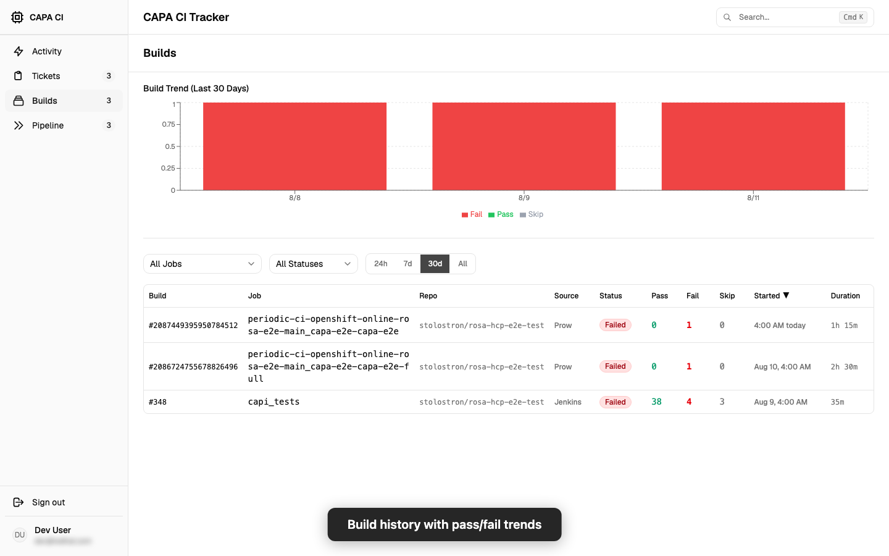
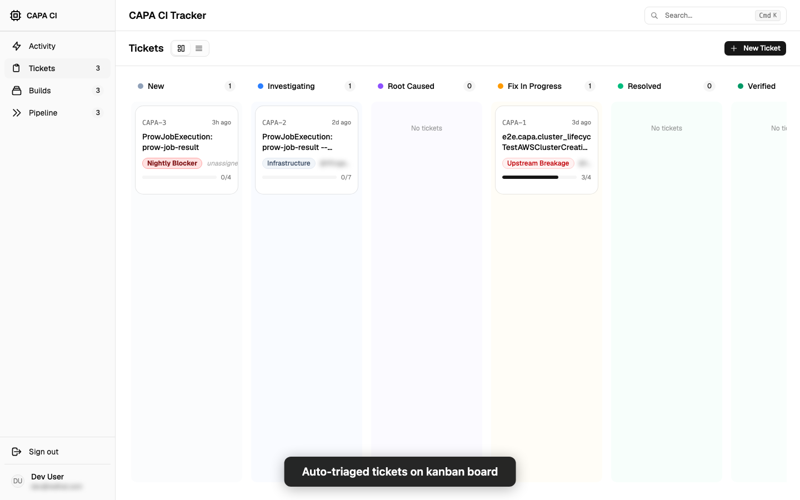
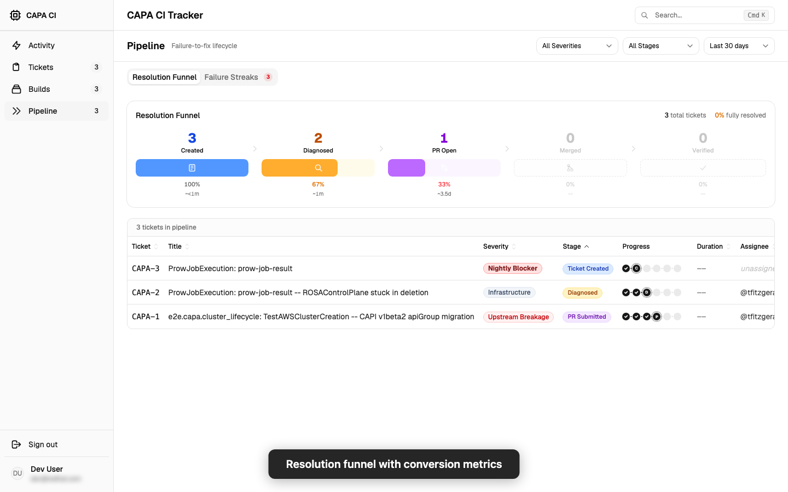
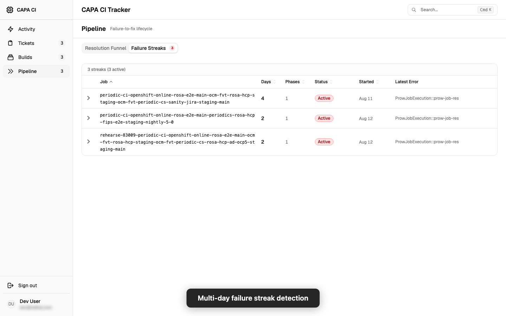

# CAPA CI Tracker

Automated CI build failure tracking for the CAPA/ROSA HCP team. Ingests failures from Prow and Jenkins, triages them into tickets, diagnoses root causes, tracks resolution through PR merge, and verifies fixes.


## Features

### Real-time CI failure activity feed
Automated ingestion from Prow and Jenkins with triage events, streak detection, and build status updates.



### Build history with KPI tiles and detail drawer
KPI stat tiles (total builds, pass rate, failed count, avg duration), color-coded row accents, combined pass/fail/skip column, chart hover tooltips, relative timestamps, and a slide-in detail drawer with test summary, linked ticket, and log.



### Auto-triaged tickets on kanban board
CI failures are automatically triaged into tickets with severity classification, error signature deduplication, and root cause diagnosis. Toggle between kanban and list view.



### Resolution funnel with SLA tiles and drop-off metrics
SLA summary tiles (median time-to-fix, oldest open, slowest stage, SLA breaches). Funnel drop-off labels show count and % lost between stages. Clickable funnel stages filter the ticket table. Stuck ticket badges highlight anything in-stage >3 days. Live elapsed duration ticks for in-flight tickets.



### Multi-day failure streak detection
Automatically detects consecutive CI failures across Prow and Jenkins. Active streaks are sorted first; recurring failures link to their open ticket. Captures relevant log lines from Prow GCS artifacts for developer triage.



## Architecture

```
Browser --> OAuth Proxy --> nginx (static frontend + /api/ proxy)
                                        |
                                 Express:3001 --> SQLite (WAL mode)
                                        |
                         node-cron agents (ingest-jenkins, ingest-prow,
                                          triage, diagnosis, resolution-tracker, notify)
```

- **Frontend:** React 19 + Vite + TailwindCSS + shadcn/ui
- **API:** Express with PostgREST-compatible filter syntax
- **Database:** SQLite in WAL mode (persistent volume at `/data/` in production)
- **Ingestion:** node-cron agents polling Prow and Jenkins APIs every 5 minutes
- **Deployment:** Single-container OCP deployment with kustomize

## Quick Start

```bash
# Install dependencies
make install

# Seed the database
make seed

# Start both servers (frontend :5173, API :3001)
make dev

# Or individually:
cd server && npm run dev    # Express API on :3001
cd frontend && npm run dev  # Vite on :5173
```

Set `VITE_DEV_BYPASS_AUTH=true` in `frontend/.env` to skip the login gate locally.

## OpenShift Deployment

Deploys as a single container (static frontend + Express API). See [deployment docs](docs/openshift_deployment.md).

```bash
oc apply -k deploy/openshift/
```
